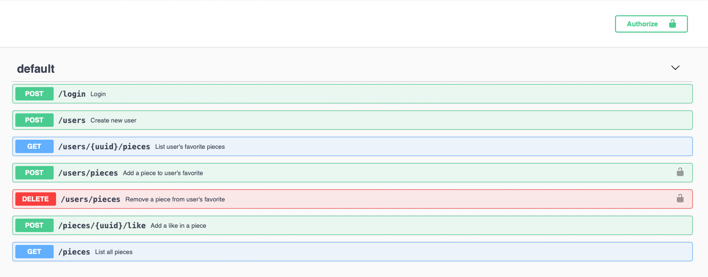

# Museum API

This is a POC project that uses some concepts of Clean Architecture. It integrates with [Harvard Art Museums API](https://harvardartmuseums.org/collections/api)
to list art pieces and users can add to favorite list. 

## Swagger

## Modules

#### Domain
The core of my application that doesn't depend on the external modules by DIP (Dependency Inversion Principle). 
It refers only to abstractions, not to concretions.
* Entities 
* Use Cases

#### API
This is the module that implements the interfaces exposed by Domain, therefore integrating with the 
infrastructure and creating an entrypoint to Web.

* Controllers 
* Gateways 
* DAOs
* DB
* Web

#### Dependency diagram
Due to DIP the Domain module doesn't care about the external modules
so the diagram gonna be look like that:  

     [API] -> [Domain]

## API implementation details

- [X] DI/SL: [Koin](https://github.com/InsertKoinIO/koin)
- [X] Web: [Javalin](https://github.com/tipsy/javalin)
- [X] HTTP: [Fuel](https://github.com/kittinunf/fuel)
- [X] ORM: [Exposed](https://github.com/JetBrains/Exposed)
- [X] Encryption: [Spring Security BCrypt](https://docs.spring.io/spring-security/reference/features/authentication/password-storage.html#authentication-password-storage-bcrypt)
- [X] Authentication: [Java JWT](https://github.com/auth0/java-jwt)
- [X] Test: [JUnit 4](https://github.com/junit-team/junit4) 
  & [MockK](https://github.com/mockk/mockk)
- [X] Documentation: [OpenAPI Plugin](https://javalin.io/plugins/openapi#openapioptions)

